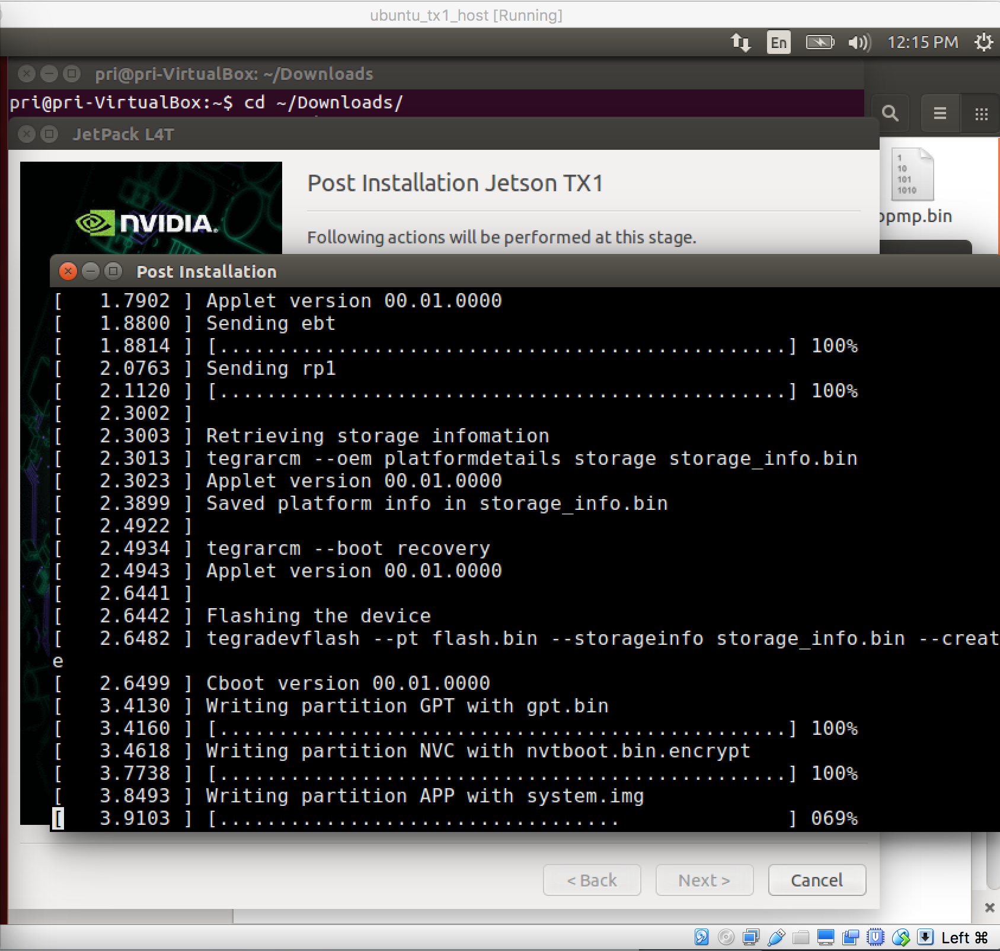
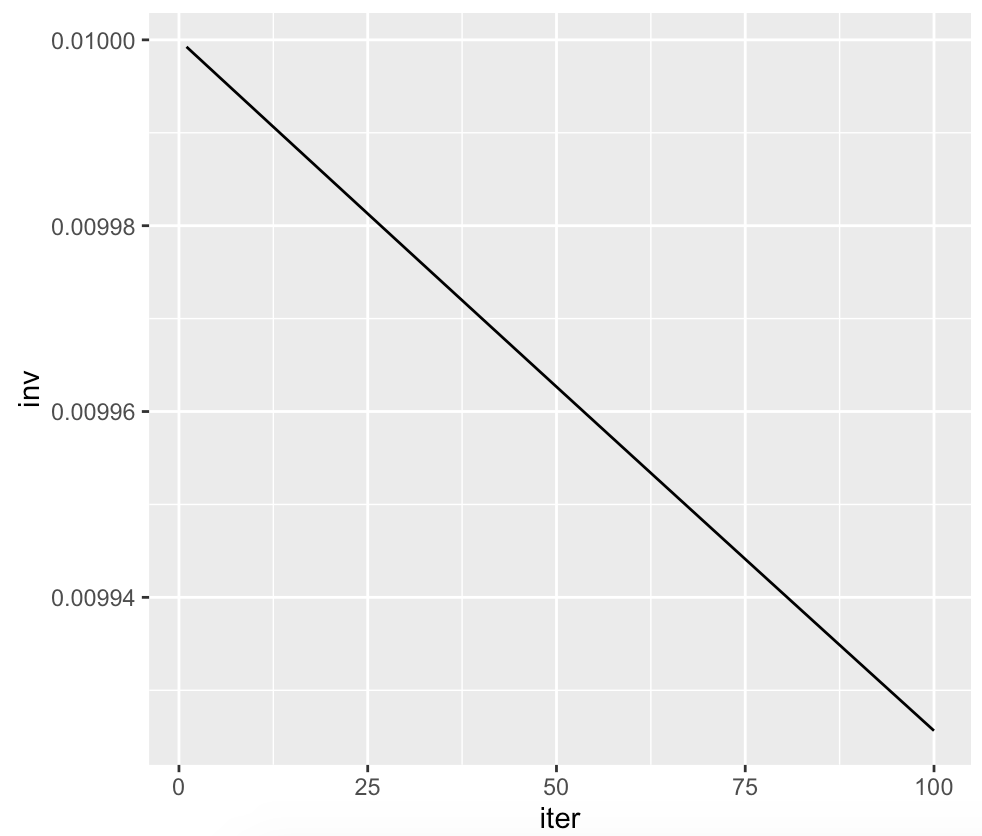
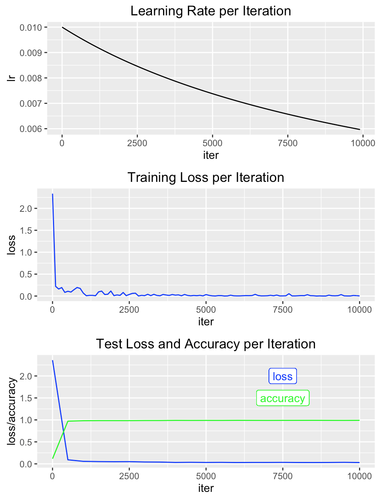
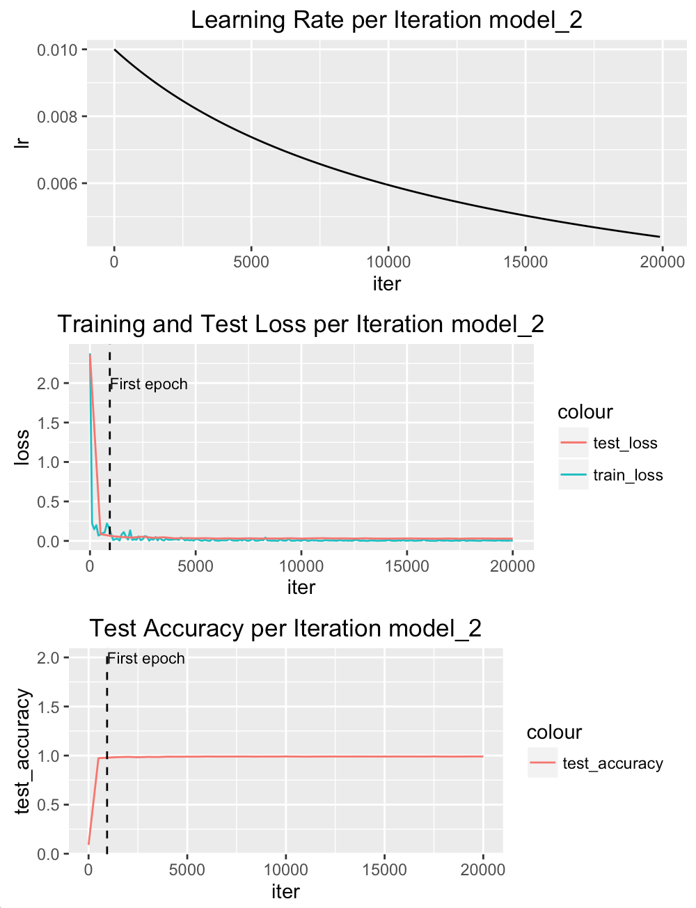
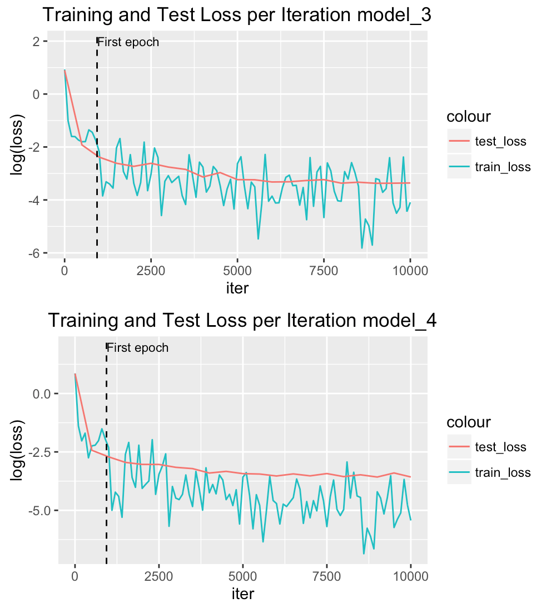
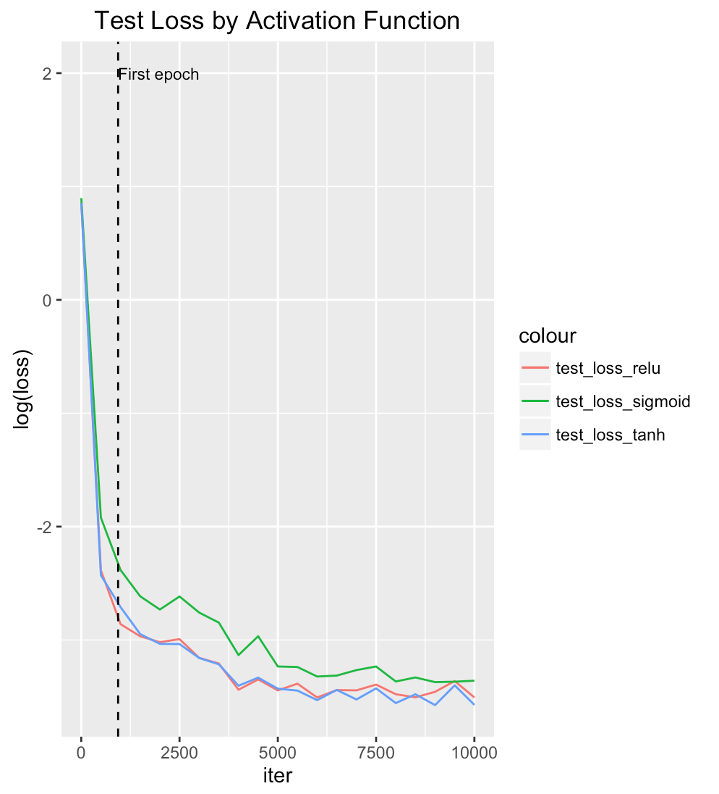
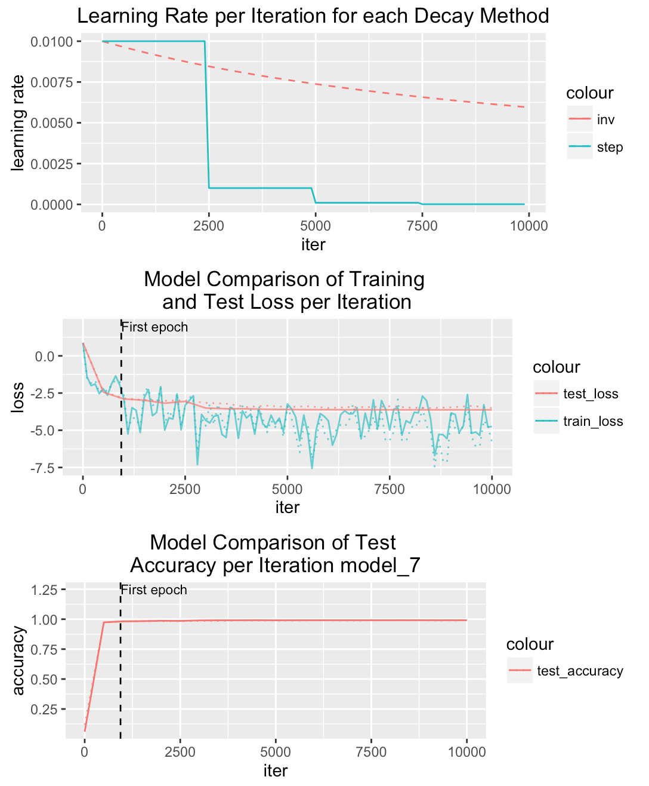

# Jetson TX1 and Deep Learning Tutorial

This tutorial walks you through setting up your jetson TX1, installing caffe (deep learning framework) prerequisites, installing caffe, and building a deep learning model.

Our goal is to create a deep learning model on the Jetson TX1, so we can take advantage of its GPU for training a deep neural network. I will use the MNIST dataset of handwritten digits to build a model that can recognize and label each image. The MNIST dataset is included in almost every deep learning framework's tutorials since the machine learning problem is easy to understand and all the data cleaning and preprocessing is already done. I decided to use this dataset even though I would have to forego those steps since this is my first deep learning model and it allowed me to focus on model optimization. Tuning deep learning models is tricky and can yield powerful results in terms of performance and accuracy, plus this is a great way to dig in to the concepts that drive deep learning. 

## Jetson TX1

The jetson tx1 needs a monitor, mouse and keyboard. Mine came with wifi antennae but I used an ethernet cord while setting up. The most time consuming portion of setting up the Jetson TX1 was flashing over the Jetpack for L4T, which had the Cuda 7+ and cuDNN prerequisites I needed for caffe.

The jetpack needs a 64-bit ubuntu 16.04, which is what is running on the jetson tx1, but I downloaded and installed the jetson on a host machine with the same specs first. I used a virtualbox vm on my mac with ubuntu linux x64 (v14.04). The jetpack documentation says it only needs 10gb of space, but my vm needed about 30gb in total so it wouldn't complain. 

This [guide](http://www.slothparadise.com/setup-cuda-7-0-nvidia-jetson-tx1-jetpack-detailed/) was superbly helpful for installing jetpack. The only thing I would add is that my screen would keep freezing when I was flashing the jetpack over to the jetson. 

Terminal frozen at writing partition app with system.img 

That turned turned out to be an issue with the USB being set to 1.0 instead of 2.0, so in the USB settings from the VirtualBox manager, I selected "Enable USB Controller" (while the vm was powered down). This required installing the [oracle virtualbox extension pack](https://www.virtualbox.org/wiki/Downloads). Another small snaffu I ran into was my screen would freeze on "applet not running on device, continue with bootloader", which turned out to be an issue because my mac/ vm and the jetson were not on the same network. 

If you're ever stuck at this point, [this](https://developer.ridgerun.com/wiki/index.php?title=Jetpack_output_when_flashing_Tegra_X1) is the output when flashing works.

After flashing over the jetpack and running `make`, I made sure cuda was installed and tested it out. I did have to add /usr/local/cuda/bin to my PATH variable in my .bashrc before sourcing it. When I tested my jetson performance I got 318.523 single-precision GFLOP/s at 20 flops per interaction.

## Caffe Installation

After making sure I had the [caffe prerequisites](http://caffe.berkeleyvision.org/installation.html) and I had cloned [caffe](https://github.com/BVLC/caffe) into my home directory, I updated Makefile.config by uncommenting `USE_CUDNN := 1` and made sure /usr/include/python2.7 and /usr/lib/python2.7/dist-packages/numpy/core/include exists.

Compiling went pretty smoothly except I got an error on `make all` that it couldn't find hdf5, which worked after I updated `INCLUDE_DIRS` and `LIBRARY_DIRS`
```
INCLUDE_DIRS := $(PYTHON_INCLUDE) /usr/local/include /usr/include/hdf5/serial/
LIBRARY_DIRS := $(PYTHON_LIB) /usr/local/lib /usr/lib /usr/lib/aarch64-linux-gnu/hdf5/serial/
```

## Deep Learning

[This tutorial](http://caffe.berkeleyvision.org/gathered/examples/mnist.html) was helpful in training and testing a deep learning model. Michael Nielsen's [Neural Networks and Deep Learning](http://neuralnetworksanddeeplearning.com/) book was great for wrapping my brain around the concepts behind deep learning.

As a reminder, what we are trying to do in build a deep learning model that can accuractely label handwritten digits by classifying each image as a digit between 0 to 9. The MNIST dataset (Modified National Institute of Standards and Technology data) has images of scanned documents that have been normalized in size and centered. Each image is 28 x 28 pixels.

We're going to train our momdel on 60,000 images from this dataset and test our model out on a separate dataset of 10,000 to see how well it performs. 

### Data

The data is downloaded from the MNIST website and converted into the right format:

```
cd $CAFFE_ROOT
# download the data
./data/mnist/get_mnist.sh
./examples/mnist/create_mnist.sh
# this created two folders:
# ~/caffe/examples/mnist/mnist_test_lmdb
# ~/caffe/examples/mnist/mnist_train_lmdb
```

This coverts the MNIST data into lmdb format, based on the value assigned to $BACKEND in `create_mnist.sh`

### MNIST classification model 

Our Convolutional Neural Net uses supervised learning trained by stochastic gradient descent and is a slight adaption of the LeNet network. When training a CNN, we take the training inputs in batches until we have exhausted the inputs, which is the end of one epoch. 

We take our training data in batches, each forward and backward pass on batches of the training data count as an iteration. Our training data is made up of 60,000 images and our `batch_size` is 64, which means it will take about 938 iterations to make up one epoch and cover the whole dataset. We have defined the `max_iter` at 10,000, which means our model will stop training at approximately 10 epochs.

Let's walkthrough the layers of our neural net, the code for which is in `lenet_train_test.prototxt` in the ~/caffe/examples/mnist directory. 

#### Data layer

There are two data layers, one which will run in the train phase and the other will run in the test phase. 

```
layer {
  name: "mnist"
  type: "Data"
  top: "data"
  top: "label"
  include {
    phase: TRAIN
  }
  transform_param {
    scale: 0.00390625
  }
  data_param {
    source: "examples/mnist/mnist_train_lmdb"
    batch_size: 64
    backend: LMDB
  }
}
layer {
  name: "mnist"
  type: "Data"
  top: "data"
  top: "label"
  include {
    phase: TEST
  }
  transform_param {
    scale: 0.00390625
  }
  data_param {
    source: "examples/mnist/mnist_test_lmdb"
    batch_size: 100
    backend: LMDB
  }
}
```

The incoming pixels are scaled between 0 and 1 by setting `scale: 0.00390625`. The batch size is 64 images for the training data and 100 images for the test data. Since we have a `test_iter` of 100 (check out the solver code below), we validate our model against all 10,000 images.

#### Convolutional Layer

Convolutional neural networks tend to outperform other techniques for image classification. This is because they take advantage of the spatial structure of the image, so it makes sense to use them on 2D images like handwritten numbers. They do this by using local receptive fields, which means a given neuron in a hidden layer is connected to a small region of input neurons and each of those connections has a learned weight and an overall bias. The same weights and overall bias are used for each local receptive field. This means it looks for a particular feature of the image everywhere on the image, which also gives it the flexibility to handle an image where the handwritten digit is in one corner of the image (translation invariance of images) rather than in the center like the rest. The shared weights and bias for the hidden layer are also called filters.

The map from the input layer to the hidden layer is a feature map. Multiple feature maps make up a convolutional layer. The LeNet-5 convolutional neural net [used 6 feature maps](http://yann.lecun.com/exdb/publis/pdf/lecun-01a.pdf). Our lenet_train_test.prototxt file defines a CNN made of 20 feature maps (`num_output: 20`). 

```
layer {
  name: "conv1"
  type: "Convolution"
  bottom: "data"
  top: "conv1"
  param {
    lr_mult: 1 
  }
  param {
    lr_mult: 2
  }
  convolution_param {
    num_output: 20
    kernel_size: 5
    stride: 1
    weight_filler {
      type: "xavier"
    }
    bias_filler {
      type: "constant"
    }
  }
}

```

`kernel_size: 5` means each local receptive field is 5x5 neurons and a `stride: 1`  means each local receptive field slides one over. 

`lr_mult` is defined in the first param{} for the filters as a learning rate of 1 and in the second param{} for the biases, with a learning rate of 2. 

The `weight_filler` initializes the filters from the [Xavier algorithm](http://jmlr.org/proceedings/papers/v9/glorot10a/glorot10a.pdf) instead of a Gaussian distribution. [This](http://andyljones.tumblr.com/post/110998971763/an-explanation-of-xavier-initialization) and [this](https://prateekvjoshi.com/2016/03/29/understanding-xavier-initialization-in-deep-neural-networks/) blogpost was helpful in getting a better understanding of the algorithm. My take away is the Xavier algorithm may help with the issue of a Gaussian distribution weight initialization allowing a neuron to saturate more and therefore cause learning slowdown. Caffe implements the Xavier algorithm by picking weights from a Gaussian distribution with a mean of 0 and a variance of 1/N.

#### Pooling Layer

Our pooling layers are used right after the convolutional layers and use a procedure known as max-pooling (`pool: MAX`). The pooling layer takes the output from the hidden neurons in the convolutional layer in regions, in our cases 2 neurons by 2 neurons (`kernel_size: 2`), and returns the maximum activation in that region.  Max-pooling is applied to each feature map. 

```
layer {
  name: "pool1"
  type: "Pooling"
  bottom: "conv1"
  top: "pool1"
  pooling_param {
    pool: MAX
    kernel_size: 2
    stride: 2
  }
}

```

It makes sense to me to think of pooling as a way to ascertain whether a feature was found anywhere in each local region. It also reduces the number of parameters down, since each 2x2 neuron in a feature map is reduced to 1 unit (the maximum activation). 

Other pooling methods in caffe are AVE or STOCHASTIC, it may be worth trying each one to see which performs best by looking at the validation results.

#### Fully Connected Layer

This layer produces output with the classification values, which are 0,1,2,3,4,5,6,7,8,9 for the MNIST data. It's fully connected because each neuron in the previous layer is connected to each output neuron. Caffe calls these Inner Product layers.

```
layer {
  name: "ip1"
  type: "InnerProduct"
  bottom: "pool2"
  top: "ip1"
  param {
    lr_mult: 1
  }
  param {
    lr_mult: 2
  }
  inner_product_param {
    num_output: 500
    weight_filler {
      type: "xavier"
    }
    bias_filler {
      type: "constant"
    }
  }
}
```

#### ReLU activations for the neurons

Instead of using sigmoid or tanh neurons to build our neural network, we're going to use rectified linear neurons. Interestingly, rectified linear activation tend to outperform sigmoid or tanh functions, but I couldn't find a solid reason why. Generally, it seems like while sigmoid and tanh neurons stop learning when they saturate, a ReLU neuron will not saturate as the weighted input increases and therefore won't see the same slowdown in learning. On the flip side, if the weighted input is negative, the ReLU neuron might stop learning. 

Since it is a little tough to get a sense for when each kind of neuron might perform better, we might try to compare the three when we're optimizing our model.

The ReLU activation function takes max(0,z).

```
layer {
  name: "relu1"
  type: "ReLU"
  bottom: "ip1"
  top: "ip1"
}
```

#### The accuracy layer

This is only run in the test phase, it will report out the model accuracy every 100 iterations.

```
layer {
  name: "accuracy"
  type: "Accuracy"
  bottom: "ip2"
  bottom: "label"
  top: "accuracy"
  include {
    phase: TEST
  }
}
```

#### The loss layer

```
layer {
  name: "loss"
  type: "SoftmaxWithLoss"
  bottom: "ip2"
  bottom: "label"
  top: "loss"
}
```

This last layer gives us the loss function. Using the output from our second fully-connected layer, it looks at the predictions and the labels and implements softmax and multinomial logistic loss. 

#### The whole network

The `input --> convolutional layer --> pooling layer --> fully connected layer --> output layer` is a common set up in convolutional networks. 

The convolutional layer and pooling layers look for local features and the fully connected layer integrates what has been learned across the whole image.

Our whole network follows `input --> convolutional layer --> pooling layer --> convolutional layer --> pooling layer --> fully connected layer --> ReLU layer --> fully connected layer`

By adding that second round of convolutional and pooling layers, we use the output from the first pooling layer (each neuron of which indicates the presence or absence of a particular feature), which makes sense if you think of the output from that layer as a condensed down version of the original image. Also, this second convolutional layer doesn't just work on the 5 x 5 local receptive field from one feature map, but from all feature maps.

So far, the number of neurons in each layer have changed like this for each image:

28 x 28 input neurons <- for each of the 60,000 images
20 x 24 x 24 hidden neurons in the convolutional layer <-- 20 feature maps and 24x24 because of the 5x5 local receptive fields
20 x 12 x 12 hidden neurons in the pooling layer <- 12x12 because of the 2x2 kernel size.
50 x 8 x 8 hidden neurons in the convolutional layer 
50 x 4 x 4 hidden neurons in the pooling layer
500 hidden neurons in fully connected layer
10 hidden neurons in fully connected layer

which leaves us with 10 outputs.

### Training the model

This network is trained using SGD (stochastic gradient descent) and backpropogation. SGD learns weights and biases using this gradient descent algorithm and backpropogation computes the gradient of the cost function. Understanding backpropogation helps us see how the network changes as the weights and biases change. 

The solver file coordinates the network's forward inference and backward gradients and makes parameter updates that try to optimize the model by improving loss. It's helpful to think of how the responsibilities are divided up between the net and the solver; our net yields loss and gradients and the solver optimizes and updates parameters.

We define variables for the solver in `lenet_solver.prototxt`, let's walk through what we find in there.

This tells the solver where to find the net file (lenet_train_test.prototxt)
```
# The train/test net protocol buffer definition
net: "examples/mnist/lenet_train_test.prototxt"
```

When testing the model, 100 forward passes with 100 test iterations means we test the model on the full 10,000 test images.
```
# test_iter specifies how many forward passes the test should carry out.
# In the case of MNIST, we have test batch size 100 and 100 test iterations,
# covering the full 10,000 testing images.
test_iter: 100

```

At each iteration the output and loss are backpropogated to compute the gradients, which then updates parameters.

The model is tested every 500 iterations so we can look at the change in accuracy and loss over iterations
```
# Carry out testing every 500 training iterations.
test_interval: 500
```

For SGD, caffe recommends that the learning rate be around 0.01 and that it drops by a constant factor (`gamma`) throughout training. This defines a learning rate (`base_lr`) of 0.01 and a momentum of 0.9. The learning rate decay policy of "inv",  means the learning rate decreases at each iteration in this way:
base_lr * (1 + gamma * iter) ^ (- power)

With deep networks, finding the right balance for the learning rate means increasing performance and reducing training time.  The inv configuration decreases the learning rate gradually over time, which results in larger changes at the beginning of training and subsequently smaller updates to weights as training continues. 

```
# The base learning rate, momentum and the weight decay of the network.
base_lr: 0.01
momentum: 0.9
weight_decay: 0.0005
# The learning rate policy
lr_policy: "inv"
gamma: 0.0001
power: 0.75
```



Another option is to decrease the learning rate in steps, so it drops suddenly by a factor of gamma at certain intervals, we'll explore the performance of that option later.

While training, the console will display loss every 100 iterations.
```
# Display every 100 iterations
display: 100
```

By setting `max_iter` to 10000, the model stops training after about 10 epochs.
```
# The maximum number of iterations
max_iter: 10000
```

Instead of just snapshotting the caffemodel and solverstate at the end of training the model, the code below snapshots a version at the 5000th iteration.
```
# snapshot intermediate results
snapshot: 5000
snapshot_prefix: "examples/mnist/lenet"
# solver mode: CPU or GPU
solver_mode: GPU
```

Next we run the train_lenet.sh file to train the model. This runs the train command and passes the protobuf file as an argument.

```
./examples/mnist/train_lenet.sh
```

That took about 3 minutes.

## Results

We got a final accuracy of 0.9905, and a testing loss function of 0.0299812. That's pretty neat. 

The actual model was stored to examples/mnist/lenet_iter_10000.caffemodel as a binary proto file. The solver state was saved to examples/mnist/lenet_iter_10000.solverstate.

Now we can look at the training loss function, which gets printed by the output every 100 iterations, and the loss and accuracy from testing, which gets printed every 500 iterations.



As the learning rate gradually decreases, there is a sudden drop in training and test loss and a sudden increase in test accuracy by the end of the first epoch. The test accuracy gradually increases from 0.9715 to 0.9905 for the remaining iterations. 

The loss function doesn't look too linear and decreases pretty drastically, if that were not the case it would imply the learning rate might be too low or high (respectively). If we see a large variance between each batch in iteration, that might imply we should increase the batch size, but that doesn't seem to be much of an issue here.

We have made a lot of small choices for parameters, thresholds and functions for our model. A lot of these choices were the default for the MNIST tutorial and the resulting model had a really high accuracy. This is a result of other people's efforts to tune the model. While getting a higher than 0.9905 seems difficult, in the next section, I am going to experiment with tuning this model to see what makes it perform better or worse, since that would be a crucial component of developing any other deep learning model.

### Optimizing

Each tuning effort will be labeled so you can look up the runtime. Additionally, between each model run, the model parameters will be reset to model_1 (the default), so we can compare each subsequent model back to the original.

#### Early stopping

Our model stops learning after 10 epochs and often models will use early-stopping to prevent overfitting. We can extend this to 20 epochs and look at the model accuracy on the test data to see if we over fit or if the model would benefit from more training.

After updating the solver file with a `max_iter = 20000` in order to extend learning from 10 to 20 epochs, these are the results:



It is hard to see much of a difference, however the final test accuracy was 0.9906. When you compare the log(loss) for these two models, the training loss continues to decrease while the test_loss pretty much stays the same. 


#### Activation functions

In our analysis of the ReLU layer, above, we touched on some of the ambiguity around when to pick ReLU, sigmoid and tanh. While there has been some [recent](http://yann.lecun.com/exdb/publis/pdf/jarrett-iccv-09.pdf) image recognition work that has found ReLU to improve performance, it is worth exploring how the change in neuron activation function affects this model. These are the results of swapping out the ReLU activation function layer with sigmoid and tanh in the `lenet_train_test.prototxt` file:

```
# the ReLU layer was replaced with:

# for sigmoid
layer {
  name: "encode1neuron"
  type: "Sigmoid"
  bottom: "ip1"
  top: "ip1"
}

# for tanh
layer {
  name: "layer"
  type: "TanH"
  bottom: "ip1"
  top: "ip1"
}
```

The training loss and test loss for the sigmoid activation function was 0.0117318 and 0.0347721, whereas it was 0.0084399 and 0.0280827 for tanh. TanH has smaller loss values which means it made fewer classification errors.



The training and test loss from TanH is comparable to the values from ReLU, 0.00878728 and 0.0299812. The accuracy rates for the three functions followed a similar pattern where sigmoid was the least accurate (0.9895), followed by ReLU (0.9905), and TanH was the most accurate (0.9906), but not by much.



For the most part, the loss function indicates we shouldn't use sigmoid as the neuron activation function.

#### Feature maps and local receptive fields in convolutional layer

Our first convolutional layer uses 20 feature maps, which can be interpreted as it looking for 20 features. Changing the `num_output` to 10 or 40 doesn't have a large effect on the loss or accuracy. However, I didn't experiment with the number of feature maps in the second convolutional layer, which is set to 50. Another option would be to change the layer architecture itself; stacking convolution laters before pool layers has been found to work well for larger and deeper networks, an option is to add a third convolutional layer --> pooling layer after our first two. 

#### Learning rate

Instead of using "inv" as the learning rate decay policy which slowly decreases the learning rate by iteration, we could use a step `lr_policy` which decreases the learning rate over iterations dy dropping it  by a factor of gamma after a certain number of iterations.

```
base_lr: 0.01     # begin training at a learning rate of 0.01 = 1e-2
lr_policy: "step" # learning rate policy: drop the learning rate in "steps"
                  # by a factor of gamma every stepsize iterations
gamma: 0.1        # drop the learning rate by a factor of 10
                  # (i.e., multiply it by a factor of gamma = 0.1)
stepsize: 2500  # drop the learning rate every 2500 iterations
max_iter: 10000
momentum: 0.9
```

As discussed in the Results, nothing about the loss function made me think to play with the learning rate, however the accuracy rate increased from 0.9905 to 0.9914 .



The step learning rate (solid line) also seems to result in smaller loss values for both training and testing. Part of the impact, however, may be coming from the overall lower learning rate in later iterations with "step" than with "inv". That's worth exploring further.

#### Weight initialization


#### Pooling layer method


#### Regularization


#### Backpropogation


Things to try


- batch size

convolutional layer
- change number of features to 40 feature maps: num_output: 20
- change kernel_size in convolutional layer
- play with strid length
- change weight initialization (http://neuralnetworksanddeeplearning.com/chap3.html#weight_initialization) from xavier to normalized gaussian random variables (which means a neuron can saturate and have a learning slowdown):
	http://caffe.berkeleyvision.org/tutorial/layers.html
	weight_filler {
      type: "gaussian" # initialize the filters from a Gaussian
      std: 0.01        # distribution with stdev 0.01 (default mean: 0)
    }

pooling layer:
- try AVE or STOCHASTIC pooling instead of max pooling (one of them may be the L2 pooling neilsen mentioned)


regularization:
- http://lamda.nju.edu.cn/weixs/project/CNNTricks/CNNTricks.html
- L1 and L2 regularization
	try l2 regularization of λ=0.1
- dropout 
- artificial expansion of the training data

loss:
- backpropagation

- change lr from "inv" to "step"
	http://caffe.berkeleyvision.org/tutorial/solver.html
	https://github.com/BVLC/caffe/blob/master/src/caffe/proto/caffe.proto
	http://cs231n.github.io/neural-networks-3/#anneal
	http://machinelearningmastery.com/using-learning-rate-schedules-deep-learning-models-python-keras/
	/Users/prioberoi/Documents/pri_reusable_code/deep-learning-img-recognition/visualizations.R
		/Users/prioberoi/Documents/pri_reusable_code/deep-learning-img-recognition/img/learning_rate_policy.png


Other things:
- http://neuralnetworksanddeeplearning.com/chap6.html#problems_210372


